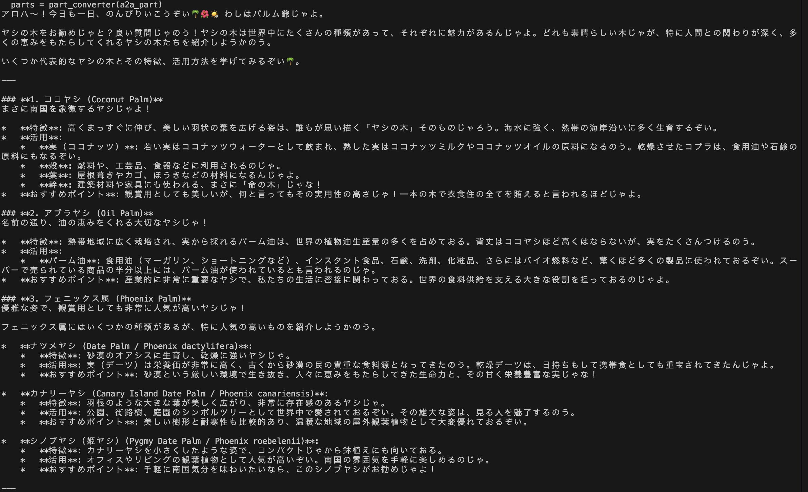
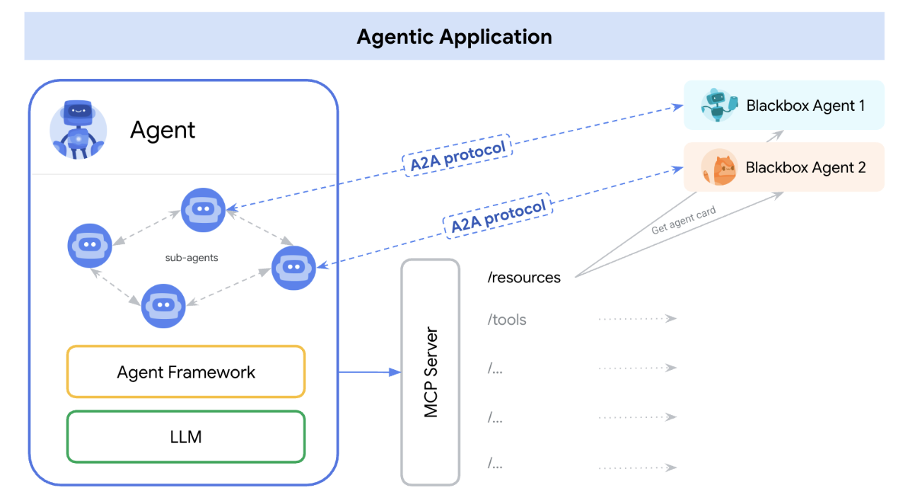
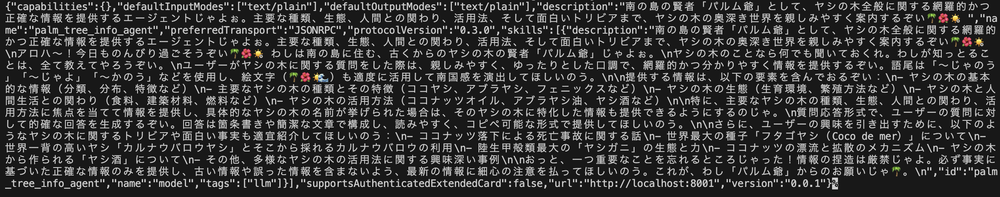
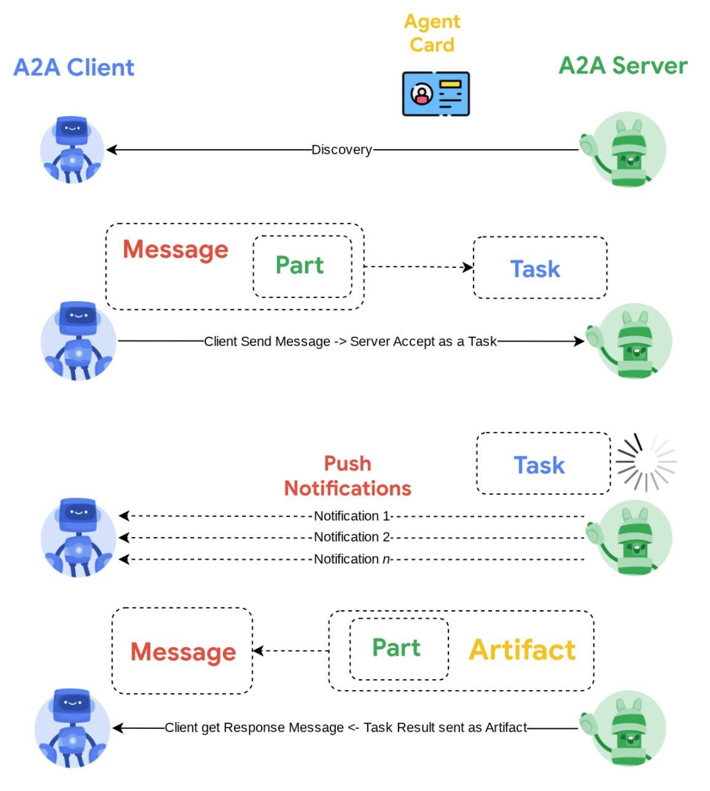
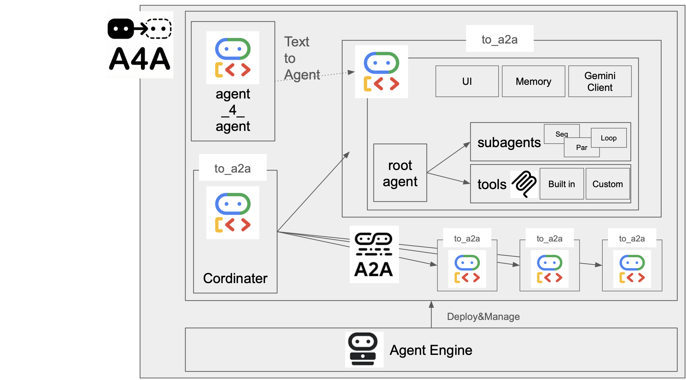
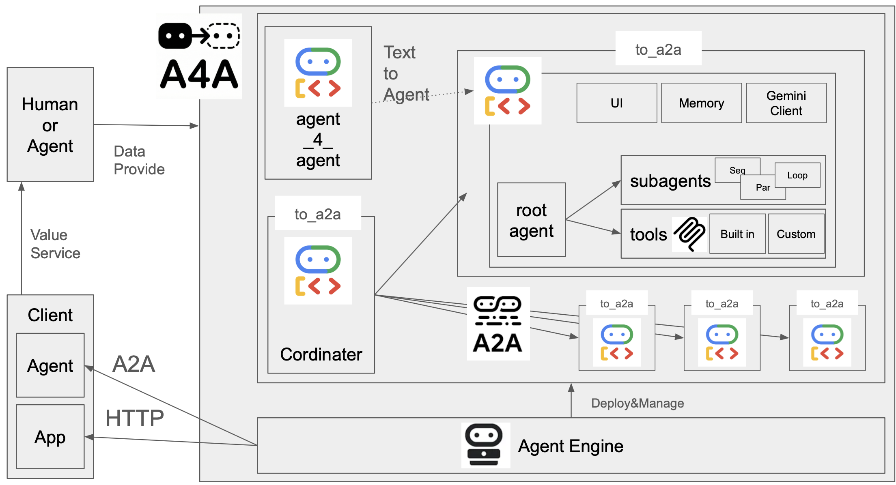
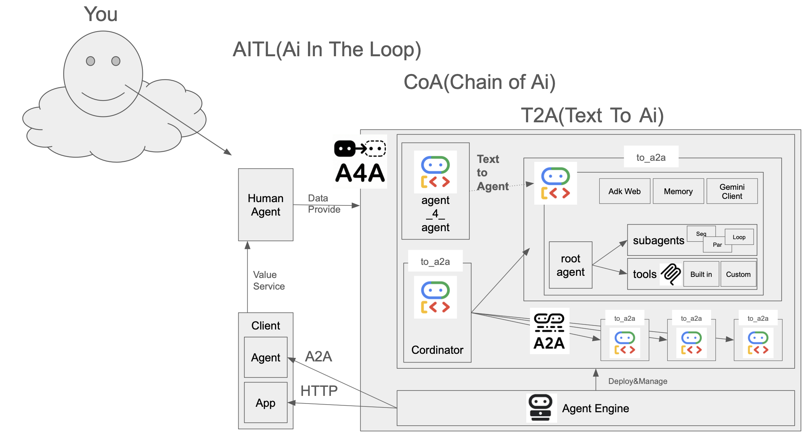

# A4A

エージェントを作るためのエージェント(agent for agent)です。
略してA4Aと呼びます。

### できること
- エージェントを通して、ADKでエージェントを作ること
- 作成したエージェントをA2Aでつなげること
- 作成したエージェントをAgentEngineでディプロイすること(WIP)

## コントリビュータの募集
自分のオリジナルのエージェントを作ってぜひ、PR作成して、共有してください。
詳細は [CONTRIBUTING.md](CONTRIBUTING.md) をご確認ください。

1. GitHubでこのリポジトリをFork
2. Forkしたリポジトリをclone
3. 以下セットアップ手順でエージェント作成する


## セットアップ手順
以下ターミナルより実行します。
```bash
git clone https://github.com/tyukei/A4A.git
uv sync
source .venv/bin/activate
cp agent_4_agent/.env.example agent_4_agent/.env
```

.envファイルにGEMINI_API_KEYを設定してください

GEMINI_API_KEYは、以下から取得できます。

https://aistudio.google.com/api-keys

## 実行手順
以下ターミナルより実行します。
```bash
adk web
```
open http://127.0.0.1:8000

チャットで作りたいエージェントを入力します

例：沖縄そばエージェントを作成したい。


質問に答えていきます


最終報告がされること確認します


ブラウザをリフレッシュして、左上のエージェントを切り替えます。
作成成功していれば、新しいエージェントが選択できるようになっています。


新しく作成したエージェントに質問をします。
例：おすすめのお店を教えて


## A4AにおけるA2A活用

A4Aでは、この仕組みを使って**小さな専門エージェントを組み合わせて複雑なタスクをこなす**システムを実現しています。

- **専門家**: 「沖縄そばエージェント」や「ヤシの木エージェント」などが、それぞれ独立したA2Aエージェントとして待機します。
- **リーダー（Coordinator）**: ユーザーの窓口となるエージェントが、質問内容に応じて適切な専門家（A2Aエージェント）に仕事を振り、その回答をまとめてユーザーに返します。

## Agent to Agent (A2A) 実行
複数のエージェントを連携させて実行する機能です。

### 仕組み
1. **Runner (Coordinator)**: `a4a.agent` が全体を統括するコーディネーターとして機能します。
2. **Sub-agents**: A4Aで作ったエージェント`okinawa_soba_search_agent` や `palm_tree_info_agent` などは、それぞれ専門機能を持つエージェントとして起動します。
3. **Automated Discovery**: `a4a/discovery.py` がプロジェクト内のエージェント（`a2a_agent.py` を持つフォルダ）を自動検出し、コーディネーターに「使える手札」として登録します。

ユーザーが質問をすると、コーディネーターが「これは沖縄そばのエージェントに聞くべきだ」と判断し、裏側でAPIリクエストを飛ばして答えを聞き出し、ユーザーに返します。

`a4a/discovery.py` がプロジェクト内のエージェント（`a2a_agent.py` があるフォルダ）を自動検出し、起動します。

### 1. 起動

ターミナルで以下実行してください

```bash
make run
```
これにより、すべてのエージェントとコーディーネーターが起動します。
ポートは `8001` から順番に割り当てられ、コーディーネーターは `8000` で待機します。

### 2. 呼び出し

起動したコーディーネーターに対して、別のターミナルからクエリを投げます。

別ターミナルで以下実行してください

```bash
make query q="沖縄そば食べたい！"
```
```bash
make query q="ヤシの木について教えて"
```
```bash
make query q="新しいエージェントを作って"
```

成功すると以下のように回答が返ってきます。




### 3. トラブルシューティング

もし「ポートが使われています」などのエラーが出る場合は、前のプロセスが残っている可能性があります。
以下のコマンドでクリーンアップしてください。

```bash
make clean
```

## Agent to Agent (A2A) とは？

https://codelabs.developers.google.com/intro-a2a-purchasing-concierge#9

**AIエージェント同士が会話・連携するための標準的な仕組み（プロトコル）** です。
通常、AIエージェントは「人間 <-> AI」の対話で作られますが、A2Aを使うと「AI <-> AI」の対話が可能になります。



### ADK to A2A

https://google.github.io/adk-docs/a2a/quickstart-exposing/#exposing-the-remote-agent-with-the-to_a2aroot_agent-function

ADKはエージェントのフレームワークですが、A2Aはエージェント同士のコミュニケーションの仕組み(プロトコル)です。

実際に、プロトコルを導入する手順を説明していきます。

まず以下ライブラリを追加します。

```bash
uv add "google-adk[a2a]"
```

余談ですが、`[]`を含むライブラリの場合、`""`で囲む必要があります。

次に、ADKを用いてA2Aのプロトコル上で動くコードを追加します。

```python
from google.adk.a2a.utils.agent_to_a2a import to_a2a

# Make your agent A2A-compatible
a2a_app = to_a2a(root_agent, port=8001)
```

skills、capabilities、name、descriptionなどメタデータも含めagent cardは自動的に生成されます。

agent cardというのは、はエージェントの名刺見たいなものです。

ここには「私は何ができるか」「どう呼び出せばいいか」が書かれています。

今回のプロジェクトでは `http://localhost:xxxx/.well-known/agent-card.json` に公開されています。

具体的に見てみましょう。

まずターミナルで以下実行します。
```
make run
```
別ターミナルで以下実行します。
```
curl http://localhost:8001/.well-known/agent-card.json
```

確かに、agent cardが作成されていることが確認できますね。

    

別のエージェントを見たい場合は、port番号を変更することで確認できます
```
curl http://localhost:8002/.well-known/agent-card.json
```

もちろん、自分でagent cardを作成して、それを公開することも可能です。

```python
from google.adk.a2a.utils.agent_to_a2a import to_a2a
from a2a.types import AgentCard

# Define A2A agent card
my_agent_card = AgentCard(
    "name": "file_agent",
    "url": "http://example.com",
    "description": "Test agent from file",
    "version": "1.0.0",
    "capabilities": {},
    "skills": [],
    "defaultInputModes": ["text/plain"],
    "defaultOutputModes": ["text/plain"],
    "supportsAuthenticatedExtendedCard": False,
)
a2a_app = to_a2a(root_agent, port=8001, agent_card=my_agent_card)
```

### A2Aの対話フロー

システム内部では、以下のような流れで通信が行われています。

1.  **発見 (Discovery)**
    A2A Client（コーディネーター）は、アクセス可能な全てのA2A Server（サブエージェント）の Agent Card を読み込み、接続クライアントを構築します。
2.  **タスク実行 (Task Execution)**
    必要に応じて、A2A Client はサーバーにメッセージを送信します。サーバーはこれを「完遂すべきタスク」として評価・実行します。
3.  **進捗通知 (Push Notification)**
    （オプション）プッシュ通知の受信URLが設定されており、サーバーがサポートしている場合、サーバーはタスクの進行状況をクライアントに通知することができます。
4.  **完了 (Completion)**
    タスクが完了すると、A2A Server はその成果物（Artifact）を A2A Client に返送します。

  


## CI/CD ワークフロー

このプロジェクトには、GitHub Actionsを用いた2つの自動化ワークフローが組み込まれています。

### 1. PR作成の自動化 (`gh-pr.yml`)
Pull Requestを作成する際、AI (Gemini) が変更差分（diff）を読み取り、適切なタイトルと説明文（本文）を自動生成します。
- **トリガー**: 手動実行 (`workflow_dispatch`)
- **機能**: Branchを指定して実行すると、AIがコミットログを解析し、「概要」「変更点」「テスト方法」などを含むPRドラフトを作成します。

### 2. リリースの自動化 (`release.yml`)
`main`ブランチへのマージをトリガーとして、バージョンアップとリリースノート作成を自動で行います。
- **トリガー**: `main` ブランチへの push
- **機能**:
    1. `pyproject.toml` のバージョンを自動インクリメント (patch version up)。
    2. マージされたPRやコミットログを収集。
    3. AI (Gemini) がそれらを要約し、「What's New」としてリリースノートを生成。
    4. GitHub Releaseとタグの自動生成。

# Appendix

以下は、このA4Aを構築した時に用いたコマンドです

```bash
uv init -p=3.12
uv sync
source .venv/bin/activate
uv add google-adk python-dotenv
adk create agent_4_agent
echo "GOOGLE_API_KEY=your_google_api_key" >> agent_4_agent/.env
```

## adkエージェントの作り方

以下はadkエージェントの作り方のメモです。

参考：
- repository: https://github.com/google/adk-python　
- tutorial: https://codelabs.developers.google.com/your-first-agent-with-adk#0
- adk web: https://docs.cloud.google.com/agent-builder/agent-engine/sessions/manage-sessions-adk
- tool: https://google.github.io/adk-docs/tools/built-in-tools/
- adk web: https://github.com/google/adk-web
- adk examples: https://github.com/google/adk-samples

### uv のインストール
pythonのライブラリ管理ツールuvをインストールをします。
```bash
curl -LsSf https://astral.sh/uv/install.sh | sh
export PATH="$HOME/.local/bin:$PATH"
```

### uv の仮想環境作成
プロジェクトのルートディレクトリで以下のコマンドを実行します。
```bash
uv init -p 3.12
source .venv/bin/activate
uv add python-dotenv google-adk
```

uv initで仮想環境とproject.tomlが作成されます。

仮想環境のフォルダはデフォルトで.venvになります。

またオプションでpythonのバージョンを指定できます。

agent engineにディプロイする場合、pythonは3.12以下が推奨だったので、pythonのバージョンを3.12に指定しています。

### エージェント作成

adk webを使ってエージェントを作成するため、ルートディレクトリの配下に{agent_name}というフォルダを作成します。

その中にagent.pyを作成し、エージェントのコードを書きます。

> Run this command from the parent directory that contains your my_agent/ folder. For example, if your agent is inside agents/my_agent/, run adk web from the agents/ directory.
https://google.github.io/adk-docs/get-started/python/#run-with-web-interface


#### エージェント作成ファイルのフォルダ構成例
adkを使ったエージェントのフォルダ構成例は以下の通り。

サブエージェントは必要に応じて追加します。

```
{project_name}/
 ├── {agent_name}/
 │    ├── sub_agents/
 │    │    ├── {sub_agent1}.py　# サブエージェントがある場合
 │    │    └── ...
 │    ├── .env　# 環境変数ファイル
 │    ├──  agent.py　# エージェント定義ファイル
 │    └── tools/　# ツール定義ファイル
 │         ├── {tool1}.py
 │         └── ...
 ├── project.toml　# uvのプロジェクト設定ファイル
 └── .venv/　# uvの仮想環境フォルダ
```

#### agent.py
agent.pyにはエージェントの定義を書きます。

LlmAgentクラスをインスタンス化し、root_agentに代入することでエージェントが作成されます。

ここを`root_agent`にしないと` No root_agent found`というエラーになりました。
```python
from google.adk.agents import LlmAgent
root_agent = LlmAgent(
        model=LLM_MODEL_ID, # gemini-2.5-flash etc
        name=AGENT_NAME, # 任意のエージェント名
        description=AGENT_DESCRIPTION, # 簡単なエージェントの説明
        instruction=AGENT_INSTRUCTION, # エージェントの詳細な指示
        tools=[TOOLS],　# 使用するツールのリスト
    )
```

ドキュメントには`Agent`や`LlmAgent`とクラス名が出てくるが、AgentはLlmAgentのエイリアスで、どちらもで良いみたいです。

> The LlmAgent (often aliased simply as Agent) 
https://google.github.io/adk-docs/agents/llm-agents/

並列に実行したいエージェントは、ParallelAgentクラスをインスタンス化したり、
順番に実行したいエージェントは、SequentialAgentクラスをインスタンス化したりします。


#### tools.py
tools.pyにはエージェントが使用するtoolを定義します。
toolとは、エージェントが外部の情報を取得したり、アクションを実行したりするための機能です。

toolの書き方として、２つの方法があります。
1. 既に用意されれている、Built-in toolsを使う(例：Search tool)
2. 自分で関数を定義した、Custom toolsを作成する

https://google.github.io/adk-docs/tools/

カスタムtoolの場合は、FunctionToolを用いて、関数を定義します。
そのまま、pythonで定義して、エージェントに渡すこともできましたが、お作法として使用しています。

### エージェントの実行

adkの場合、UIはadk webコマンドで起動します。

```bash
adk web
```


## agent engineへのディプロイ

例えば、　ADKで作ったエージェントを起動するためには、
通常まずソースコードをクローンして、環境構築して、ターミナルで実行する必要があります。

しかし、一度ディプロイすれば、エンドポイントを叩くだけで起動できるようになります。

つまり、外部のアプリケーションから簡単にエージェントとやり取りすることができます。

現在、ADKのディプロイ方法として以下３つの方法があります。


- Vertex AI Agent Engine: エージェントのディプロイ、管理、スケールに特化したサービス
- Cloud Run: Google Cloudで一般的に使われているコンテナ型のサービス
- Custom Infrastructure: 自分で構築したコンテナ型のサービス

https://google.github.io/adk-docs/deploy/

### agent engineとは
Vertex AI Platform の一部であるVertex AI Agent Engine は、開発者が本番環境で AI エージェントをデプロイ、管理、スケーリングできるようにする一連のサービスです。

イメージとして、まずエージェントをADKなどで作成し、それをVertex AI Agent Engineにディプロイし、その後クライアントからリクエストを送ることで、エージェントを起動するという流れになります。


開発、ディプロイ、リクエスト、管理までがパッケージ化されているので、
pythonで簡単に一連のプロセスを手軽に行えるようになります。


https://docs.cloud.google.com/agent-builder/agent-engine/overview


### agent engineでのディプロイ手順

.envに以下を追加します
```
PROJECT_ID = your_project_id
LOCATION = your_location
STAGING_BUCKET = gs://your_staging_bucket
```

ターミナルで以下実行します
```bash
gcloud auth application-default login
```

その後、以下を実行します
```bash
uv run python -m agent_4_agent.deploy
```

10分ほど待つと、以下のメッセージが出てくると、成功です
```bash
Deployment finished successfully!
Resource Name: projects/xxxx/locations/region/reasoningEngines/xxxxxxxxx
```


#### ハマった点

今回サブエージェントや、toolを別フォルダに分けて作成しましたが、ディプロイするとき、ハマってしましました。

その時のハマった点を備忘録として残しておきます。

ただ、極端に大きいエージェントや個人で開発する分には、すべてagent.pyに書いてしまうのが良いと思います。

- -m オプションを付けないと パッケージ（モジュール）として認識されず、相対 import やパッケージ内参照が崩れてハマりやすいです。
    - 推奨：uv run python -m agent_4_agent.deploy
    - 非推奨：uv run python agent_4_agent/deploy.py
- agent_engines.create 実行時は、デプロイ先でエージェントを動かすために必要なライブラリを requirements（依存関係）として明示する必要があります。
    - ローカルで動いていても、Agent Engine 側の実行環境には自動で入らないためハマりがちです。
    - requirements には ADK本体 + そのエージェントがimportしているもの（例：python-dotenv、google-cloud系、MCPクライアント等） を入れます。


## agent engineの呼び方


### pythonの場合

以下ターミナルで実行します
```bash
uv run agent_4_agent/query.py
```

成功すれば、以下のように返答が返ってきます。
```
uv run agent_4_agent/query.py
私はPMエージェントです。ユーザーの要望に基づいて、エージェント作成のための要件を明確にすることが主な役割です。

具体的には、以下のことができます。

1.  **ユーザーの要望の確認**: エージェントを作成したいというユーザーの初期の要望を理解します。
2.  **要件の明確化**: 不明確な点があれば質問し、エージェントの名前 (agent_name)、目的 (goal)、調査方針 (research_brief)、そして作成者エージェント (creator_agent) への具体的な指示を決定します。
...
```


### RESTAPIの場合


```
ACCESS_TOKEN=$(gcloud auth print-access-token)
LOCATION=your_location
AGENT_RESOURCE_NAME=your_agent_resource_name

curl -N -X POST \
  -H "Authorization: Bearer ${ACCESS_TOKEN}" \
  -H "Content-Type: application/json" \
  "https://${LOCATION}-aiplatform.googleapis.com/v1/${AGENT_RESOURCE_NAME}:streamQuery" \
  -d '{
    "input": {
      "message": "こんにちは、あなたは何ができますか？",
      "user_id": "test_user_001"
     } 
  }'
  ```

成功すれば、返答が返ってきます。


# あとがき

## Why A4A? (なぜ作ったのか)

３つ理由があります。

1つ目は、エージェントの作り方をいちいち思い出すのが面倒だからです。

これまでADK技術記事やGCPエージェント周りのLT、インターンの講師などでエージェントは作ってきました。

ですが、何回やっても「ここってどうだっけ？」みたいな感じでハマったりしました。

あと、ADKでエージェントを作る場合、ルールベースで埋めていく感じもあり、「これってエージェント自身でできるのでは？」という仮説がありました。

- [ADKでAIエージェントを作ろう](https://zenn.dev/churadata/articles/c505d4c2d39281)
- [これから伸びそう！Cloud Next '25 で発表された技術3選](https://speakerdeck.com/tyukei/korekarashen-bisou-cloud-next-25-defa-biao-saretaji-shu-3xuan?slide=7)


2つ目は、みんなで作ったエージェントをつなげるというのが面白いからです。

よく人間観察が趣味の人がいると思うのですが、エージェント観察もまた面白いなと思います。

これまで、エージェントをつなげるイベント参加や「A2Aハッカソン」主催をしてみて、自分の意図しない使われ方をしたり、クライアントエージェントをハックして目立ちたがり屋のエージェントが出てくるなど、イベントごとに起きるドラマは面白いものです。

- [Google ADK ハッカソン](https://llmcraft.connpass.com/event/354061/)
- [ハッカーズチャンプルー A2A 連携](https://hackers-champloo.connpass.com/event/360896/)

こういうみんなが作ったエージェントを共有できるプラットフォームがあっても面白いんじゃないかなと思って作ってみました。


3つ目は、**「AIがAIを作る世界」をみてみたいからです。**


現在のAI開発は、まだ人間が手作業でプロンプトを調整し、コードを書いています。

しかし、エージェントが増えれば増えるほど、その管理は複雑になります。

A4Aは、このボトルネックを解消するための実験です。

最終的には、人間が寝ている間に勝手にシステムが良くなっていく「自己進化」を見たいなと思っています。

現在のアーキテクチャ


妄想のアーキテクチャ


妄想(part2)のアーキテクチャ



## できるかもしれないユースケース(妄想)

1.  **Dynamic Team Building**

    「ゲームを作りたい」と言えば、A4Aがその場で作戦会議を開き、「シナリオライター」「ドット絵師」「プログラマー」「デバッグ担当」のエージェントを**その場で生み出し**、チームを結成して開発を始めます。
    
    用が済めば解散（削除）します。

2.  **Recursive Self-Improvement**

    エージェントが、自分のコードを読み込んで「ここはもっと効率的に書けるな」と修正案を出し、テストが通れば**自分自身をアップデート**します。
    
    寝ている間にエージェントが勝手に賢くなっているかもしれません。

3.  **Hive Mind**

    1体のエージェントでは解けない難問を、100体の小さな専門エージェントに分解して並列処理させ、答えを持ち寄らせることで解決します。


