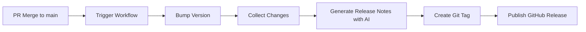

# CI/CDワークフロー

このドキュメントでは、A4Aプロジェクトに組み込まれているGitHub Actionsを用いた自動化ワークフローについて説明します。

---

## 概要

このプロジェクトには、開発プロセスを効率化するための2つの自動化ワークフローが組み込まれています：

1. **PR作成の自動化** (`gh-pr.yml`)
2. **リリースの自動化** (`release.yml`)

どちらもAI（Gemini）を活用して、開発者の手作業を削減し、一貫性のあるドキュメントを生成します。

---

## 1. PR作成の自動化 (`gh-pr.yml`)

Pull Requestを作成する際、AI（Gemini）が変更差分（diff）を読み取り、適切なタイトルと説明文（本文）を自動生成します。

### トリガー

- **手動実行** (`workflow_dispatch`)
- GitHub Actionsのタブから手動で実行します

### 機能

Branchを指定して実行すると、AIがコミットログを解析し、以下を含むPRドラフトを作成します：

- **概要**: 変更の目的と背景
- **変更点**: 具体的な変更内容
- **テスト方法**: 変更を検証する方法
- **その他**: 注意事項やレビューポイント

### 使い方

1. 変更をコミットしてブランチにプッシュ
2. GitHub Actionsのタブを開く
3. "Create PR with AI"ワークフローを選択
4. ブランチ名を入力して実行
5. 生成されたPRを確認・編集して公開

### ワークフローファイルの例

```yaml
name: Create PR with AI

on:
  workflow_dispatch:
    inputs:
      branch:
        description: 'Branch name to create PR from'
        required: true

jobs:
  create-pr:
    runs-on: ubuntu-latest
    steps:
      - uses: actions/checkout@v3
      
      - name: Get diff
        run: |
          git diff origin/main...HEAD > diff.txt
      
      - name: Generate PR description with Gemini
        env:
          GEMINI_API_KEY: ${{ secrets.GEMINI_API_KEY }}
        run: |
          # Gemini APIを使ってPR説明を生成
          python scripts/generate_pr_description.py
      
      - name: Create Pull Request
        uses: peter-evans/create-pull-request@v5
        with:
          title: ${{ env.PR_TITLE }}
          body: ${{ env.PR_BODY }}
```

### メリット

- **時間節約**: PR説明を手動で書く時間を削減
- **一貫性**: すべてのPRが同じフォーマットで記述される
- **品質向上**: AIが変更内容を客観的に分析

---

## 2. リリースの自動化 (`release.yml`)

`main`ブランチへのマージをトリガーとして、バージョンアップとリリースノート作成を自動で行います。

### トリガー

- **`main`ブランチへのpush**
- PRがマージされると自動的に実行されます

### 機能

1. **バージョンの自動インクリメント**
   - `pyproject.toml`のバージョンを自動的にpatch version up
   - 例: `1.2.3` → `1.2.4`

2. **リリースノートの生成**
   - マージされたPRやコミットログを収集
   - AI（Gemini）がそれらを要約
   - "What's New"としてリリースノートを生成

3. **GitHub Releaseとタグの自動生成**
   - 新しいバージョンタグを作成
   - リリースノートを含むGitHub Releaseを公開

### ワークフローの流れ



### ワークフローファイルの例

```yaml
name: Release

on:
  push:
    branches:
      - main

jobs:
  release:
    runs-on: ubuntu-latest
    steps:
      - uses: actions/checkout@v3
        with:
          fetch-depth: 0
      
      - name: Bump version
        run: |
          # pyproject.tomlのバージョンをインクリメント
          python scripts/bump_version.py
      
      - name: Collect changes
        run: |
          # 前回のリリースからの変更を収集
          git log --pretty=format:"%s" $(git describe --tags --abbrev=0)..HEAD > changes.txt
      
      - name: Generate release notes with Gemini
        env:
          GEMINI_API_KEY: ${{ secrets.GEMINI_API_KEY }}
        run: |
          # Gemini APIを使ってリリースノートを生成
          python scripts/generate_release_notes.py
      
      - name: Create Release
        uses: actions/create-release@v1
        env:
          GITHUB_TOKEN: ${{ secrets.GITHUB_TOKEN }}
        with:
          tag_name: v${{ env.NEW_VERSION }}
          release_name: Release v${{ env.NEW_VERSION }}
          body: ${{ env.RELEASE_NOTES }}
```

### メリット

- **自動化**: リリースプロセス全体が自動化される
- **一貫性**: バージョニングとリリースノートが標準化される
- **透明性**: すべての変更が自動的にドキュメント化される

---

## セットアップ方法

### 必要な準備

1. **GitHub Secretsの設定**

GitHub リポジトリの Settings > Secrets and variables > Actions で以下を設定：

- `GEMINI_API_KEY`: Gemini APIキー
  - https://aistudio.google.com/api-keys で取得

2. **ワークフローファイルの配置**

`.github/workflows/`ディレクトリに以下のファイルを配置：

```
.github/
└── workflows/
    ├── gh-pr.yml
    └── release.yml
```

3. **スクリプトの準備**

AI生成用のスクリプトを`scripts/`ディレクトリに配置：

```
scripts/
├── generate_pr_description.py
├── generate_release_notes.py
└── bump_version.py
```

---

## カスタマイズ方法

### バージョニング戦略の変更

デフォルトではpatch versionをインクリメントしますが、以下のように変更できます：

```python
# scripts/bump_version.py

def bump_version(version_type='patch'):
    # version_type: 'major', 'minor', 'patch'
    current = get_current_version()
    
    if version_type == 'major':
        new = bump_major(current)
    elif version_type == 'minor':
        new = bump_minor(current)
    else:
        new = bump_patch(current)
    
    return new
```

### リリースノートのフォーマット変更

Geminiへのプロンプトを変更することで、リリースノートのフォーマットをカスタマイズできます：

```python
# scripts/generate_release_notes.py

PROMPT = """
以下の変更ログから、リリースノートを生成してください。

フォーマット:
## 🎉 新機能
- ...

## 🐛 バグ修正
- ...

## 📝 ドキュメント
- ...

変更ログ:
{changes}
"""
```

---

## トラブルシューティング

### ワークフローが実行されない

**原因**: ワークフローファイルの構文エラー

**解決策**: YAMLの構文を確認

```bash
# yamllintでチェック
yamllint .github/workflows/
```

### Gemini APIエラー

**原因**: APIキーが設定されていない、または無効

**解決策**: GitHub Secretsを確認

1. Settings > Secrets and variables > Actions
2. `GEMINI_API_KEY`が正しく設定されているか確認

### バージョンの重複エラー

**原因**: 同じバージョンタグが既に存在

**解決策**: 既存のタグを削除するか、バージョニングロジックを修正

```bash
# タグを削除
git tag -d v1.2.3
git push origin :refs/tags/v1.2.3
```

---

## ベストプラクティス

### 1. コミットメッセージの規約

Conventional Commitsを使用すると、AIがより正確にリリースノートを生成できます：

```
feat: 新機能を追加
fix: バグを修正
docs: ドキュメントを更新
refactor: リファクタリング
test: テストを追加
```

### 2. PRのレビュー

AI生成されたPR説明は必ずレビューし、必要に応じて修正してください。

### 3. リリースノートの確認

自動生成されたリリースノートは公開前に確認し、必要に応じて編集してください。

---

## 次のステップ

- GitHub Actionsの詳細 → https://docs.github.com/actions
- Conventional Commits → https://www.conventionalcommits.org/
- セマンティックバージョニング → https://semver.org/
