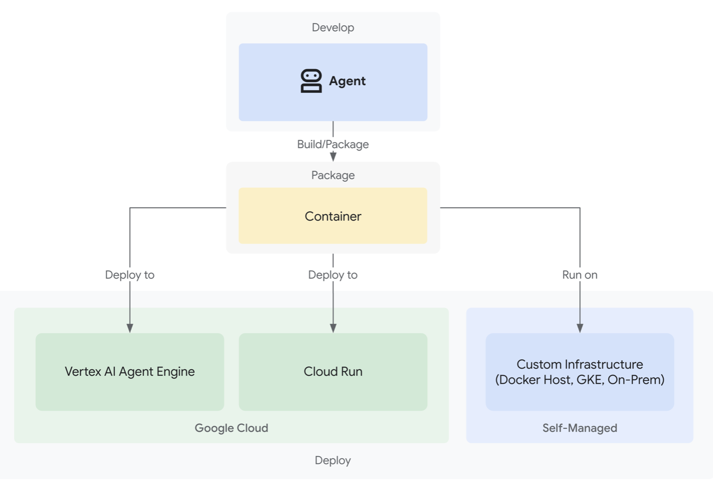
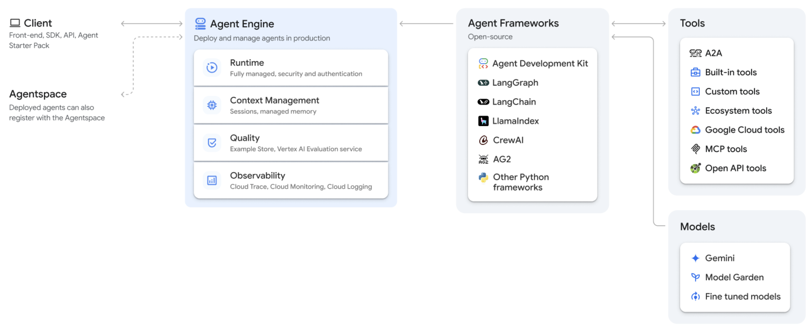
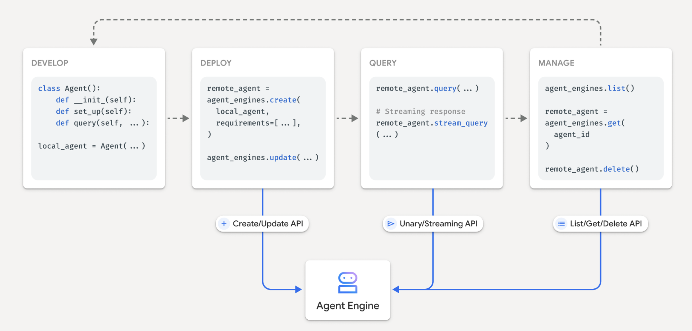

# Agent Engineへのディプロイ

このドキュメントでは、ADKで作成したエージェントをVertex AI Agent Engineにディプロイする方法を説明します。

---

## Agent Engineを使う理由

例えば、ADKで作ったエージェントを起動するためには、通常まずソースコードをクローンして、環境構築して、ターミナルで実行する必要があります。

しかし、**一度ディプロイすれば、エンドポイントを叩くだけで起動できるようになります。**

つまり、外部のアプリケーションから簡単にエージェントとやり取りすることができます。

---

## ディプロイ方法の比較

現在、ADKのディプロイ方法として以下3つの方法があります：



| 方法 | 説明 | 特徴 |
|------|------|------|
| **Vertex AI Agent Engine** | エージェントのディプロイ、管理、スケールに特化したサービス | ADKとの統合が最も簡単、自動スケーリング |
| **Cloud Run** | Google Cloudで一般的に使われているコンテナ型のサービス | 柔軟性が高い、カスタマイズ可能 |
| **Custom Infrastructure** | 自分で構築したコンテナ型のサービス | 完全なコントロール、独自の要件に対応 |

参考: https://google.github.io/adk-docs/deploy/

---

## Vertex AI Agent Engineとは

Vertex AI Platformの一部であるVertex AI Agent Engineは、開発者が本番環境でAIエージェントをデプロイ、管理、スケーリングできるようにする一連のサービスです。

### 全体の流れ

イメージとして、まずエージェントをADKなどで作成し、それをVertex AI Agent Engineにディプロイし、その後クライアントからリクエストを送ることで、エージェントを起動するという流れになります。



### Agent Engineの利点

開発、ディプロイ、リクエスト、管理までがパッケージ化されているので、Pythonで簡単に一連のプロセスを手軽に行えるようになります。



参考: https://docs.cloud.google.com/agent-builder/agent-engine/overview

---

## ディプロイ手順

### 1. 環境変数の設定

`.env`ファイルに以下を追加します：

```env
PROJECT_ID=your_project_id
LOCATION=your_location
STAGING_BUCKET=gs://your_staging_bucket
```

#### 環境変数の説明

- **PROJECT_ID**: Google CloudのプロジェクトID
  - [Google Cloud Console](https://console.cloud.google.com/)で確認できます
- **LOCATION**: デプロイするリージョン
  - 例: `us-central1`, `asia-northeast1`など
- **STAGING_BUCKET**: ステージング用のCloud Storageバケット
  - 事前に作成しておく必要があります
  - 例: `gs://my-agent-staging-bucket`

### 2. 認証

ターミナルで以下を実行します：

```bash
gcloud auth application-default login
```

このコマンドにより、ローカル環境からGoogle Cloudにアクセスするための認証情報が設定されます。

### 3. ディプロイの実行

以下を実行します：

```bash
uv run python -m agent_4_agent.deploy
```

> **重要**: `-m`オプションを付けることで、パッケージ（モジュール）として認識されます。

### 4. 完了確認

10分ほど待つと、以下のメッセージが出てくると成功です：

```bash
Deployment finished successfully!
Resource Name: projects/xxxx/locations/region/reasoningEngines/xxxxxxxxx
```

このResource Nameは、後でエージェントを呼び出す際に使用します。

---

## ハマった点と解決策

今回サブエージェントやツールを別フォルダに分けて作成しましたが、ディプロイする際にハマってしまいました。

その時のハマった点を備忘録として残しておきます。

> **注意**: 極端に大きいエージェントや個人で開発する分には、すべて`agent.py`に書いてしまうのが良いと思います。

### 1. `-m`オプションの重要性

**問題**: 相対importやパッケージ内参照が崩れる

**解決策**: `-m`オプションを付けてモジュールとして実行する

```bash
# 推奨
uv run python -m agent_4_agent.deploy

# 非推奨
uv run python agent_4_agent/deploy.py
```

`-m`オプションを付けないと、パッケージ（モジュール）として認識されず、相対importやパッケージ内参照が崩れてハマりやすいです。

### 2. 依存関係の明示

**問題**: ローカルで動いていても、Agent Engine側でモジュールが見つからない

**解決策**: `agent_engines.create`実行時に、デプロイ先でエージェントを動かすために必要なライブラリを`requirements`（依存関係）として明示する

ローカルで動いていても、Agent Engine側の実行環境には自動で入らないためハマりがちです。

`requirements`には以下を含めます：
- ADK本体
- そのエージェントがimportしているもの
  - 例: `python-dotenv`, `google-cloud`系, MCPクライアント等

**deploy.pyの例**:

```python
from google.cloud.aiplatform import reasoning_engines

reasoning_engine = reasoning_engines.ReasoningEngine.create(
    reasoning_engine=agent,
    requirements=[
        "google-adk",
        "python-dotenv",
        "google-cloud-aiplatform",
        # その他必要なライブラリ
    ],
    # その他の設定...
)
```

---

## Agent Engineの呼び出し方法

ディプロイしたエージェントを呼び出す方法は2つあります。

### 方法1: Pythonから呼び出す

以下のコマンドをターミナルで実行します：

```bash
uv run agent_4_agent/query.py
```

成功すれば、以下のように返答が返ってきます：

```
uv run agent_4_agent/query.py
私はPMエージェントです。ユーザーの要望に基づいて、エージェント作成のための要件を明確にすることが主な役割です。

具体的には、以下のことができます。

1.  **ユーザーの要望の確認**: エージェントを作成したいというユーザーの初期の要望を理解します。
2.  **要件の明確化**: 不明確な点があれば質問し、エージェントの名前 (agent_name)、目的 (goal)、調査方針 (research_brief)、そして作成者エージェント (creator_agent) への具体的な指示を決定します。
...
```

#### query.pyの実装例

```python
from google.cloud.aiplatform import reasoning_engines

# Resource Nameを指定
AGENT_RESOURCE_NAME = "projects/xxxx/locations/region/reasoningEngines/xxxxxxxxx"

# エージェントを取得
agent = reasoning_engines.ReasoningEngine(AGENT_RESOURCE_NAME)

# クエリを送信
response = agent.query(
    input={
        "message": "こんにちは、あなたは何ができますか？",
        "user_id": "test_user_001"
    }
)

print(response)
```

---

### 方法2: REST APIから呼び出す

REST APIを使って直接呼び出すこともできます。

```bash
ACCESS_TOKEN=$(gcloud auth print-access-token)
LOCATION=your_location
AGENT_RESOURCE_NAME=your_agent_resource_name

curl -N -X POST \
  -H "Authorization: Bearer ${ACCESS_TOKEN}" \
  -H "Content-Type: application/json" \
  "https://${LOCATION}-aiplatform.googleapis.com/v1/${AGENT_RESOURCE_NAME}:streamQuery" \
  -d '{
    "input": {
      "message": "こんにちは、あなたは何ができますか？",
      "user_id": "test_user_001"
     } 
  }'
```

成功すれば、返答が返ってきます。

#### REST APIの利点

- 任意のプログラミング言語から呼び出せる
- Webhookやサーバーレス関数との統合が容易
- 外部サービスとの連携が簡単

---

## トラブルシューティング

### ディプロイが失敗する

**原因1**: 権限が不足している

```bash
# 必要な権限を確認
gcloud projects get-iam-policy YOUR_PROJECT_ID
```

**原因2**: ステージングバケットが存在しない

```bash
# バケットを作成
gsutil mb -l LOCATION gs://your-staging-bucket
```

### モジュールが見つからないエラー

**原因**: `requirements`に必要なライブラリが含まれていない

**解決策**: `deploy.py`の`requirements`リストに追加する

### タイムアウトエラー

**原因**: エージェントの処理が長すぎる

**解決策**: タイムアウト設定を調整する

```python
reasoning_engine = reasoning_engines.ReasoningEngine.create(
    reasoning_engine=agent,
    requirements=[...],
    extra_packages=[...],
    # タイムアウトを延長
    timeout=600,  # 秒単位
)
```

---

## 次のステップ

- A2A対応エージェントとしてディプロイする → [a2a_guide.md](a2a_guide.md)
- CI/CDパイプラインを構築する → [cicd.md](cicd.md)
- エージェントの監視とログ管理 → [Google Cloud Console](https://console.cloud.google.com/)
