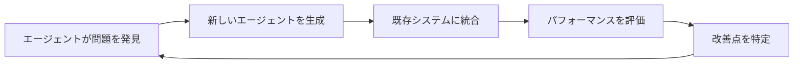
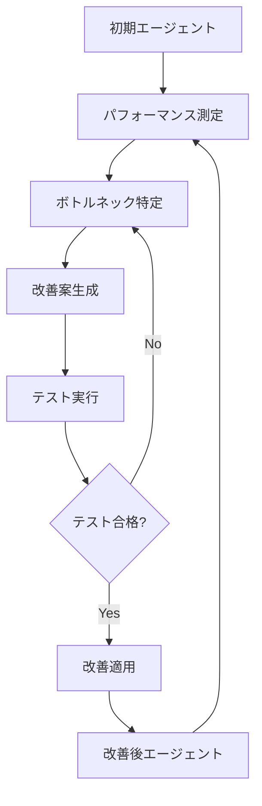

# Why A4A? - A4Aを作った理由と未来への展望

このドキュメントでは、A4A（Agent for Agent）を作った背景と、将来実現したいビジョンについて説明します。

---

## Why A4A? (なぜ作ったのか)

A4Aを作った理由は3つあります。

---

### 理由1: エージェントの作り方をいちいち思い出すのが面倒だから

これまでADK技術記事やGCPエージェント周りのLT、インターンの講師などでエージェントは作ってきました。

ですが、何回やっても「ここってどうだっけ？」みたいな感じでハマったりしました。

あと、ADKでエージェントを作る場合、ルールベースで埋めていく感じもあり、**「これってエージェント自身でできるのでは？」** という仮説がありました。

#### 過去の活動

- [ADKでAIエージェントを作ろう](https://zenn.dev/churadata/articles/c505d4c2d39281)
- [これから伸びそう！Cloud Next '25 で発表された技術3選](https://speakerdeck.com/tyukei/korekarashen-bisou-cloud-next-25-defa-biao-saretaji-shu-3xuan?slide=7)

#### エージェント作成の課題

従来のエージェント作成プロセスには、以下のような課題がありました：

1. **繰り返し作業**: 毎回同じような設定を手動で行う必要がある
2. **ドキュメント参照**: 細かい設定方法を毎回ドキュメントで確認する必要がある
3. **ベストプラクティス**: 最適な構成を毎回考える必要がある

A4Aは、これらの課題を解決するために、**エージェント自身がエージェントを作る**というアプローチを採用しました。

---

### 理由2: みんなで作ったエージェントをつなげるのが面白いから

よく人間観察が趣味の人がいると思うのですが、**エージェント観察もまた面白い**なと思います。

これまで、エージェントをつなげるイベント参加や「A2Aハッカソン」主催をしてみて、自分の意図しない使われ方をしたり、クライアントエージェントをハックして目立ちたがり屋のエージェントが出てくるなど、イベントごとに起きるドラマは面白いものです。

#### 過去のイベント

- [Google ADK ハッカソン](https://llmcraft.connpass.com/event/354061/)
- [ハッカーズチャンプルー A2A 連携](https://hackers-champloo.connpass.com/event/360896/)

#### エージェント観察の面白さ

エージェント同士の相互作用から生まれる予期しない振る舞いは、以下のような興味深い現象を生み出します：

1. **創発的な振る舞い**: 個々のエージェントは単純でも、組み合わせることで複雑な振る舞いが生まれる
2. **個性の発現**: 各エージェントが独自の「性格」を持ち、それが相互作用に影響する
3. **協調と競争**: エージェント同士が協力したり、時には競争したりする

こういう**みんなが作ったエージェントを共有できるプラットフォーム**があっても面白いんじゃないかなと思って作ってみました。

---

### 理由3: 「AIがAIを作る世界」をみてみたいから

現在のAI開発は、まだ人間が手作業でプロンプトを調整し、コードを書いています。

しかし、エージェントが増えれば増えるほど、その管理は複雑になります。

**A4Aは、このボトルネックを解消するための実験です。**

#### 現在のAI開発の課題

- **スケーラビリティ**: エージェントの数が増えると、人間が管理しきれなくなる
- **一貫性**: 複数の開発者が関わると、エージェントの品質にばらつきが出る
- **進化速度**: 人間の手作業では、AI技術の進化に追いつけない

#### A4Aのビジョン

最終的には、**人間が寝ている間に勝手にシステムが良くなっていく「自己進化」** を見たいなと思っています。

これは以下のようなサイクルを想定しています：



---

## できるかもしれないユースケース（妄想）

以下は、A4Aの技術を発展させることで実現できるかもしれない、未来のユースケースです。

---

### 1. Dynamic Team Building

**コンセプト**: タスクに応じて、その場で最適なエージェントチームを編成

#### シナリオ

「ゲームを作りたい」と言えば、A4Aがその場で作戦会議を開き、以下のようなエージェントを**その場で生み出し**、チームを結成して開発を始めます：

- **シナリオライター**: ストーリーとキャラクター設定を担当
- **ドット絵師**: ゲームのグラフィックを作成
- **プログラマー**: ゲームロジックを実装
- **デバッグ担当**: バグを発見して修正

用が済めば解散（削除）します。

#### 技術的な実現方法

1. **タスク分析**: ユーザーの要求を分析し、必要なスキルセットを特定
2. **エージェント生成**: 各スキルに特化したエージェントを動的に生成
3. **チーム編成**: エージェント間の役割分担と連携方法を定義
4. **タスク実行**: チームで協力してタスクを完遂
5. **解散**: タスク完了後、不要になったエージェントを削除

#### メリット

- **効率性**: 必要な時に必要なエージェントだけを生成
- **柔軟性**: タスクに応じて最適なチーム構成を実現
- **コスト削減**: 使わないエージェントを維持する必要がない

---

### 2. Recursive Self-Improvement

**コンセプト**: エージェントが自分自身を改善する

#### シナリオ

エージェントが、自分のコードを読み込んで「ここはもっと効率的に書けるな」と修正案を出し、テストが通れば**自分自身をアップデート**します。

寝ている間にエージェントが勝手に賢くなっているかもしれません。

#### 技術的な実現方法

1. **自己分析**: エージェントが自分のコードとパフォーマンスを分析
2. **改善案の生成**: より効率的な実装方法を提案
3. **テスト実行**: 改善案が既存の機能を壊さないか検証
4. **自動適用**: テストが通れば、改善案を自動的に適用
5. **フィードバックループ**: 改善の効果を測定し、次の改善に活かす

#### 実現に向けた課題

- **安全性**: 自己改善が予期しない動作を引き起こさないようにする
- **検証**: 改善が本当に有益かを客観的に評価する
- **制御**: 改善のプロセスを人間が監視・制御できるようにする

#### 期待される効果



---

### 3. Hive Mind

**コンセプト**: 集合知による問題解決

#### シナリオ

1体のエージェントでは解けない難問を、100体の小さな専門エージェントに分解して並列処理させ、答えを持ち寄らせることで解決します。

#### 技術的な実現方法

1. **問題分解**: 大きな問題を小さなサブ問題に分割
2. **エージェント配置**: 各サブ問題に最適な専門エージェントを割り当て
3. **並列実行**: すべてのエージェントが同時に作業を開始
4. **結果統合**: 各エージェントの結果を集約して最終解を導出
5. **品質検証**: 統合された解が元の問題を解決しているか確認

#### 応用例

- **科学研究**: 複雑な科学的問題を複数の視点から分析
- **データ分析**: 大規模データセットを並列処理して洞察を抽出
- **創作活動**: 複数のエージェントが協力して小説や音楽を作成

#### アーキテクチャ例

```
                    [Coordinator Agent]
                            |
        +-------------------+-------------------+
        |                   |                   |
    [Agent 1]           [Agent 2]           [Agent N]
    Sub-task 1          Sub-task 2          Sub-task N
        |                   |                   |
        +-------------------+-------------------+
                            |
                    [Result Aggregator]
                            |
                    [Final Solution]
```

---

## 技術的な課題と今後の展望

### 現在の課題

1. **信頼性**: エージェントが生成するコードの品質保証
2. **セキュリティ**: 悪意のあるエージェントの防止
3. **スケーラビリティ**: 大量のエージェントを効率的に管理
4. **コスト**: API呼び出しのコスト最適化

### 今後の展望

1. **エージェントマーケットプレイス**: 誰でもエージェントを公開・共有できるプラットフォーム
2. **エージェント評価システム**: エージェントの品質を客観的に評価
3. **自動最適化**: エージェント構成の自動チューニング
4. **マルチモーダル対応**: テキストだけでなく、画像や音声も扱えるエージェント

---

## おわりに

A4Aは、「AIがAIを作る」という未来への第一歩です。

まだ実験段階ですが、コミュニティの皆さんと一緒に、この技術を発展させていきたいと思っています。

ぜひ、あなたのアイデアやフィードバックをお聞かせください！

---

## 参加方法

- **GitHub**: [tyukei/A4A](https://github.com/tyukei/A4A)
- **コントリビューション**: [CONTRIBUTING.md](../CONTRIBUTING.md)
- **ディスカッション**: GitHubのIssuesやDiscussionsで議論しましょう

---

## 関連ドキュメント

- A4Aの使い方 → [usage.md](usage.md)
- アーキテクチャ → [architecture.md](architecture.md)
- ADKチュートリアル → [adk_tutorial.md](adk_tutorial.md)
